# Car Dealership Inventory System

A full-stack Car Dealership Inventory System built with the MERN stack, featuring JWT authentication, role-based access control, vehicle inventory management, search and filtering, purchase/restock functionality, and Test-Driven Development (TDD).

## Project Structure

- `backend/` - Node.js, Express, MongoDB (Mongoose)
- `frontend/` - React, Vite, Tailwind CSS

## 🧪 Testing

-all TDD test cases RED and GREEN both part in image that are in docs/documents

## 📸 Screenshots

### Login

| Failed Test (RED) | Passing Implementation (GREEN) |
|-------------------|-------------------------------|
| 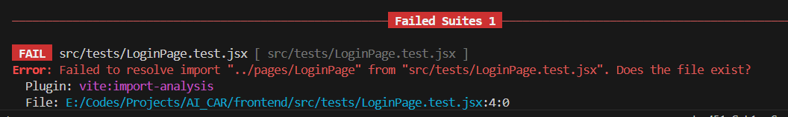 | 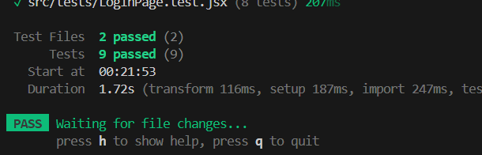 |

---

### Register

| Failed Test (RED) | Passing Implementation (GREEN) |
|-------------------|-------------------------------|
| 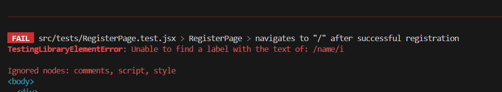 | 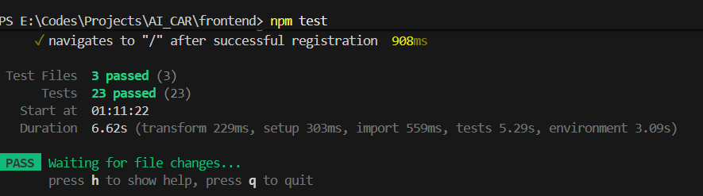 |

---

### Vehicle CRUD

| Failed Test (RED) | Passing Implementation (GREEN) |
|-------------------|-------------------------------|
| 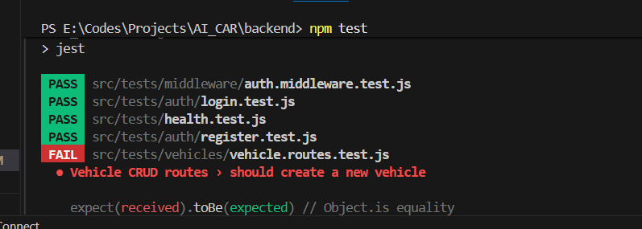 | 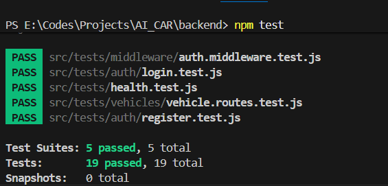 |

---

### Vehicle Search

| Failed Test (RED) | Passing Implementation (GREEN) |
|-------------------|-------------------------------|
| 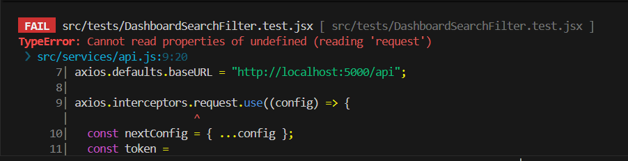 | 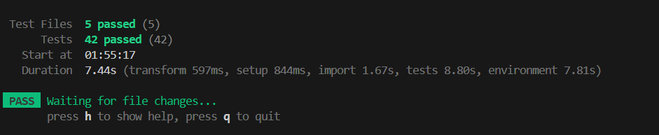 |

---

### Vehicle Purchase

| Failed Test (RED) | Passing Implementation (GREEN) |
|-------------------|-------------------------------|
| 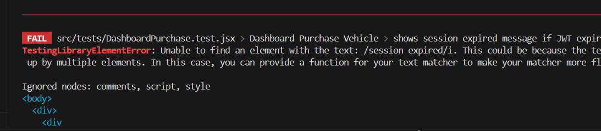 | 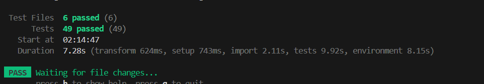 |

---

### Vehicle Purchase API

| Failed Test (RED) | Passing Implementation (GREEN) |
|-------------------|-------------------------------|
| 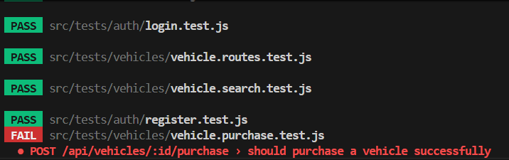 | 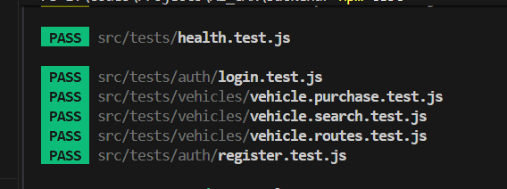 |

---

### Vehicle Search API

| Failed Test (RED) | Passing Implementation (GREEN) |
|-------------------|-------------------------------|
| 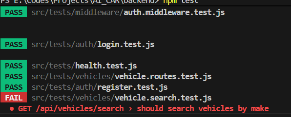 | 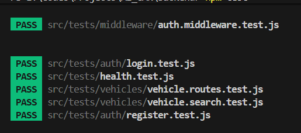 |

---

### Vehicle Restore

| Failed Test (RED) | Passing Implementation (GREEN) |
|-------------------|-------------------------------|
| 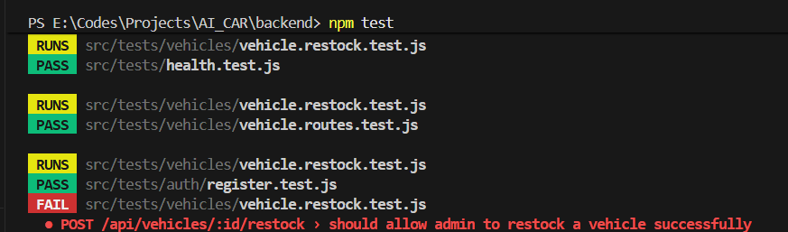 | 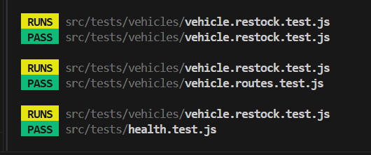 |

---

### Vehicle Authorization

| Failed Test (RED) | Passing Implementation (GREEN) |
|-------------------|-------------------------------|
| 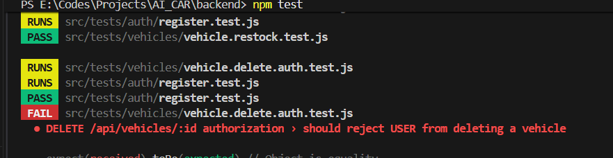 | 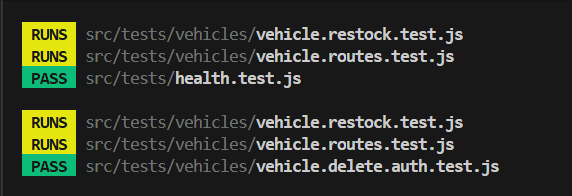 |

---

### Admin Inventory

| Failed Test (RED) | Passing Implementation (GREEN) |
|-------------------|-------------------------------|
| 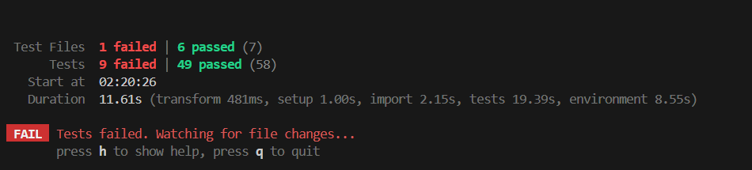 | 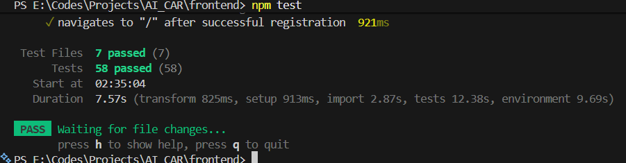 |

---

### Logout

| Failed Test (RED) | Passing Implementation (GREEN) |
|-------------------|-------------------------------|
| 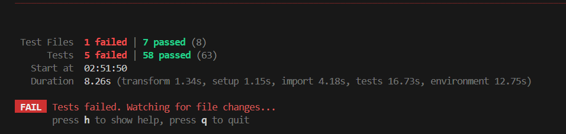 | 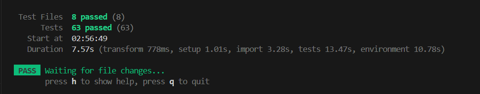 |

---

### Health Check

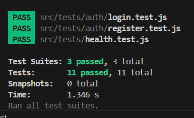


```bash
npm test
```

**Current Status**

| Feature | Status |
|---------|--------|
| Health API | ✅ |
| Register API | ✅ |
| Login API | ✅ |
| JWT Middleware | ✅ Passed |
| Vehicle CRUD | ✅ Passed |


Registration and Login APIs were developed following the Red → Green → Refactor cycle. The final passing test report is included.


## API Examples

### Register User

**Request**

`POST /api/auth/register`

```json
{
  "name": "Prince",
  "email": "senjaliyaprince009@gmail.com",
  "password": "123456"
}
```

**Response (201 Created)**

```json
{
  "success": true,
  "message": "User registered successfully",
  "user": {
    "_id": "...",
    "name": "Prince",
    "email": "senjaliyaprince009@gmail.com",
    "role": "USER"
  }
}
```

---

### Validation Example

**Request**

```json
{
  "name": "Prince",
  "email": "abc@gmail.com",
  "password": "123"
}
```

**Response (400 Bad Request)**

```json
{
  "success": false,
  "message": "Password must be at least 6 characters long"
}
```

## Login User

**Endpoint**

`POST /api/auth/login`

### Request

```json
{
  "email": "senjaliyaprince009@gmail.com",
  "password": "123456"
}
```

### Success Response (200 OK)

```json
{
  "success": true,
  "message": "Login successful",
  "token": "your_jwt_token",
  "user": {
    "_id": "...",
    "name": "Prince",
    "email": "senjaliyaprince009@gmail.com",
    "role": "USER"
  }
}
```

---

### Invalid Password

**Request**

```json
{
  "email": "senjaliyaprince009@gmail.com",
  "password": "111111"
}
```

**Response (401 Unauthorized)**

```json
{
  "success": false,
  "message": "Invalid email or password"
}
```

---

### Email Not Found

**Request**

```json
{
  "email": "unknown@gmail.com",
  "password": "123456"
}
```

**Response (404 Not Found)**

```json
{
  "success": false,
  "message": "User not found"
}
```

## Protected Route Authentication

### Without Token

```
GET /api/protected
```

Response

```json
{
  "success": false,
  "message": "Access token is required"
}
```

Status

```
401 Unauthorized
```

---

### Invalid Token

```
Authorization: Bearer abc123
```

Response

```json
{
  "success": false,
  "message": "Invalid token"
}
```

Status

```
401 Unauthorized
```

---

### Valid Token

```
Authorization: Bearer <JWT_TOKEN>
```

Response

```json
{
  "success": true,
  "message": "Protected route accessed successfully"
}
```

Status

```
200 OK
```


## TDD Example

### 🔴 Red Phase

Vehicle CRUD tests were written before implementation.

Result:

- 4 Vehicle CRUD tests failed as expected.

### 🟢 Green Phase

After implementing the APIs:

- All Vehicle CRUD tests passed successfully.


# Vehicle APIs

> **Note:** All Vehicle APIs require a valid JWT token.

Authorization Header

```http
Authorization: Bearer <JWT_TOKEN>
```

---

## Create Vehicle

**Endpoint**

`POST /api/vehicles`

### Request

```json
{
  "make": "Toyota",
  "model": "Fortuner",
  "category": "SUV",
  "price": 4500000,
  "quantity": 5
}
```

### Success Response (201 Created)

```json
{
  "success": true,
  "message": "Vehicle created successfully",
  "vehicle": {
    "_id": "...",
    "make": "Toyota",
    "model": "Fortuner",
    "category": "SUV",
    "price": 4500000,
    "quantity": 5
  }
}
```

---

## Get All Vehicles

**Endpoint**

`GET /api/vehicles`

### Success Response (200 OK)

```json
{
  "success": true,
  "vehicles": [
    {
      "_id": "...",
      "make": "Toyota",
      "model": "Fortuner",
      "category": "SUV",
      "price": 4500000,
      "quantity": 5
    }
  ]
}
```

---

## Update Vehicle

**Endpoint**

`PUT /api/vehicles/:id`

### Request

```json
{
  "price": 4700000,
  "quantity": 8
}
```

### Success Response (200 OK)

```json
{
  "success": true,
  "message": "Vehicle updated successfully"
}
```

---

## Delete Vehicle

**Endpoint**

`DELETE /api/vehicles/:id`

### Success Response (200 OK)

```json
{
  "success": true,
  "message": "Vehicle deleted successfully"
}
```

---


## Search Vehicles

**Endpoint**

`GET /api/vehicles/search`

Requires JWT Authentication.

### Search by Make

```
GET /api/vehicles/search?make=Toyota
```

### Search by Model

```
GET /api/vehicles/search?model=Fortuner
```

### Search by Category

```
GET /api/vehicles/search?category=SUV
```

### Search by Price

```
GET /api/vehicles/search?minPrice=1000000&maxPrice=5000000
```

### Success Response

```json
{
  "success": true,
  "vehicles": [
    {
      "_id": "...",
      "make": "Toyota",
      "model": "Fortuner",
      "category": "SUV",
      "price": 4500000,
      "quantity": 5
    }
  ]
}
```


## Purchase Vehicle

**Endpoint**

`POST /api/vehicles/:id/purchase`

Requires JWT Authentication.

### Success Response (200)

```json
{
  "success": true,
  "message": "Vehicle purchased successfully"
}
```

### Out of Stock (400)

```json
{
  "success": false,
  "message": "Vehicle is out of stock"
}
```

### Vehicle Not Found (404)

```json
{
  "success": false,
  "message": "Vehicle not found"
}
```

